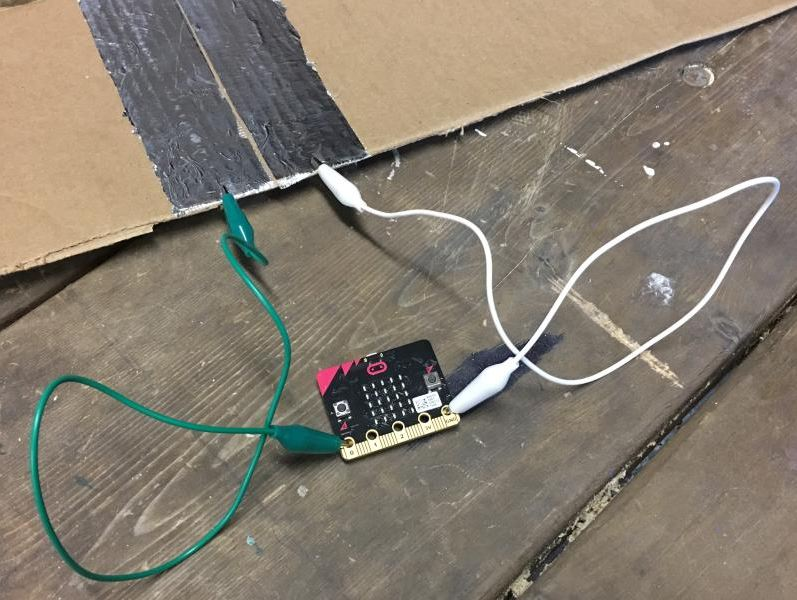
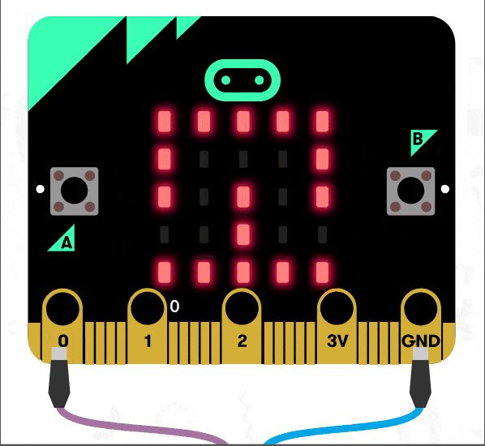
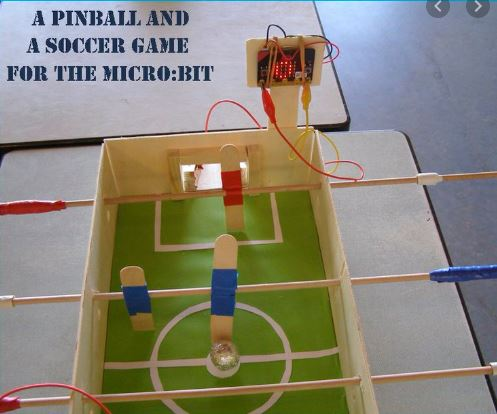
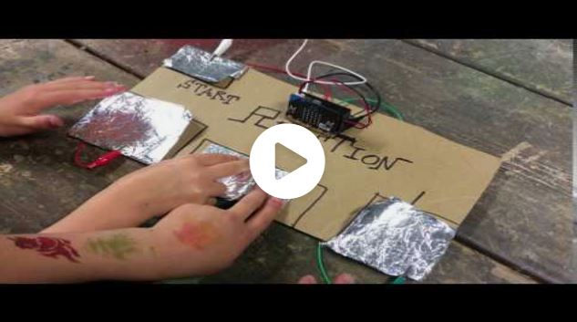
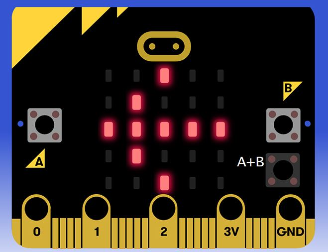
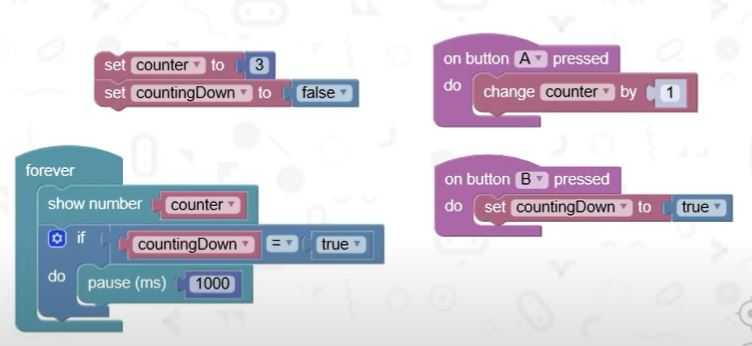
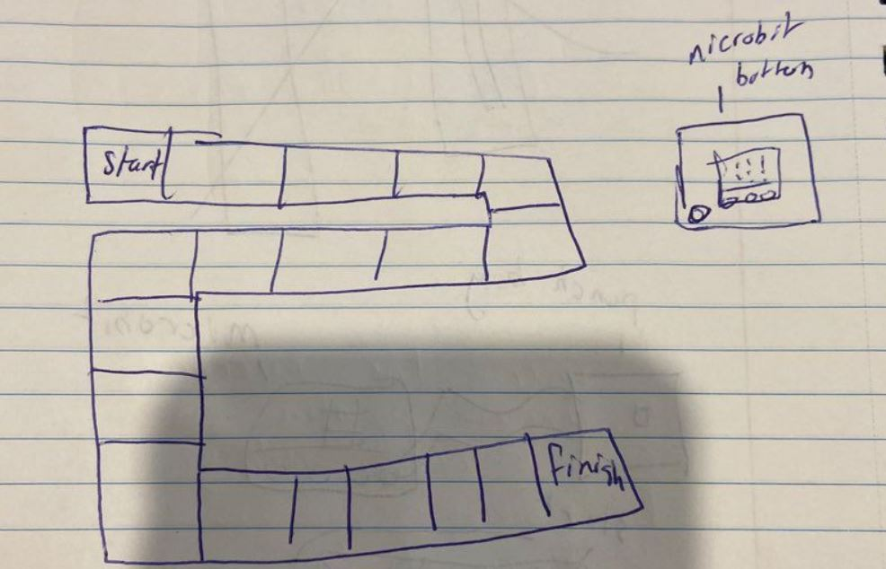
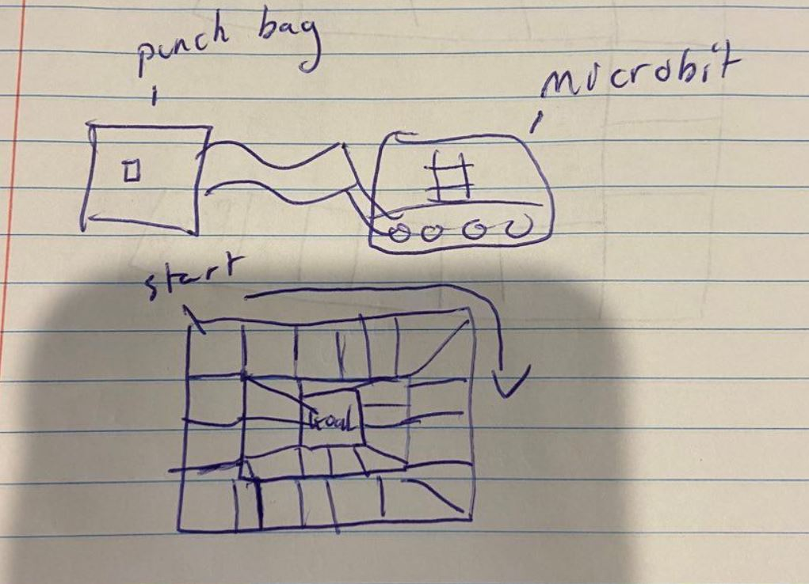
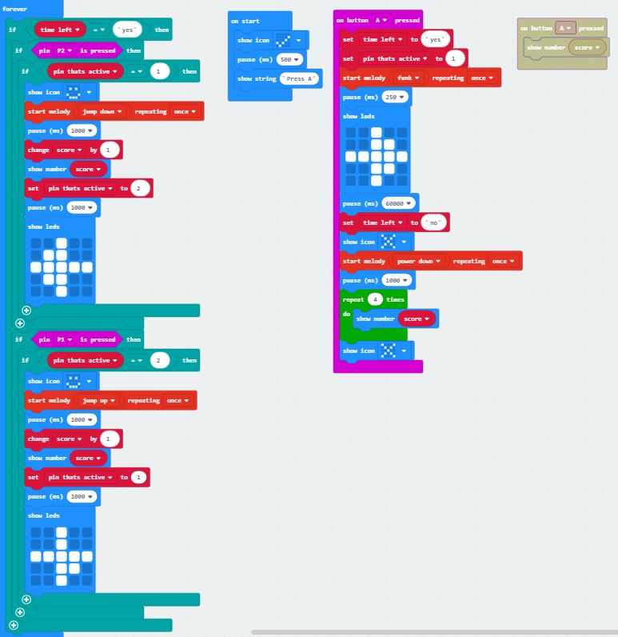

# 1701QCA Final project journal: Ben O'Rourke

<!--- As for other assessments, fill out the following journal sections with information relevant to your project. --->

<!--- Markdown reference: https://guides.github.com/features/mastering-markdown/ --->

## Related projects ##
<!--- Find about 6 related projects to the project you choose. A project might be related through  function, technology, materials, fabrication, concept, or code. Don't forget to place an image of the related project in the appropriate folder and insert the filename in the appropriate places below. Copy the markdown block of code below for each project you are showing. --->

### Related project 1 ###
Timing Gate

The micro bit timing gate is a similar concept to my project. The timing gate uses metal plates to pickup when something has been sent across them  and send a message to the micro bit telling it to turn the timer off.  The timing gates code is also similar to the code I will use in my project. The similarities are that the ball in my project will roll onto a conductive platform and turn off and on a timer in the micro bit.
https://makecode.microbit.org/projects/timing-gates

### Related project 2 ###
 Maze Runner
 
 
 
This project relates to my project as it is a maze that is coded to know when the maze has been completed, Similar to my project the micro bit changes when the goal has been complete. this project was used as inspiration.  
https://tinkercademy.com/tutorials/maze-runner/

### Related project 3 ###
Microbit football

This project relates to my project as it uses a conductive ball to cross a goal that send a messege to the microbit creating a action for example this one keeps the score where mine changes where it wants you to go. 

https://www.youtube.com/watch?v=ZNpZgQ5MXwI&feature=youtu.be
### Related project 4 ###
Reaction time microbit game

The Materials used in this project are the same as what my project requires. it uses a conductive material that creatres a action with the microbit. the crocidile clamps are connecting everthing together. 

https://makecode.microbit.org/projects/reaction-time

### Related project 5 ###
Microbit arrow

The code used in this basic project will be part of the project uising the arrows to point where the ball needs to head next. The arrow in my project will be guids as to where the next goal is. 
https://www.elecfreaks.com/store/blog/post/micro-bit-fundamental-course-buttondisplay.html

### Related project 6 ###
Count Down Timer

The microbit code seen here will be used to let the player know when they are out of time and how long they have to get there. This code will be mixed with code for the arrows in correlation. 
https://www.youtube.com/watch?v=mnBYkQ9ku8I

## Other research ##
I have taken inspiration from a toutorial made by Pinkey Pepper the youtube chanel where they have made a maze game the points to where you are required to travel. Although simular in design mine is diffrent in that it has a inbuilt time limit and multiple destinations for the ball to travel. The code will also be diffrent as there are many parts needing to  be added.

## Conceptual development ##

### Design intent ###

My intent is to create a functioning ball maze race with multiple goals and a timer making the game challlenging and fun. 

### Design ideation ###

### Design concept 1 ###

Random number generated boardgame

The game is designed around the micro bit picking a random number and a player having to move the amount shown by the micro bit.  The micro bit would also show symbols that correlate with a action in the game.  There is a button on the micro bit and depending on how long it is pressed the higher the number will show but this also increases the chances of getting a symbol. 

### Design concept 2 ###
Power measurer board game

Similar to concept 1 the goal of this game is reach the end of a track. Depending on how hard the pressure sensor is hit the micro bit will display the distance the player will travel.  It will use a punching bag containing a sensor.

### Final design concept ###
My Final design was a ball maze game where the goal is to reach two goals back and forth scoring points while under a 1 min timelimit. Changes were made from the prototype which aloud me to execute the project better. The Display will make a noice and point to the goal. When the goal is reached it will make another noise indicating the goal is reached and to move to the next one. WHen the time is up a X is displayed and the final score is shown. 
### Interaction flowchart ###

## Process documentation ##

### Final Project Decisions ###
When designing my final project I took into consideration how I wanted my project to be used. I determined that I wanted to slightly change the way the game was played in the prototype but also keep the core idea. The project is still a ball maze game. where it differentiated itself from the prototype is that instead on it being a race the ball has to reach each goal as many times as possible within a minute. I asked people about which idea would be more entertaining and the strong majority said the final project I chose oppose to the prototype. I added a speaker so that the game felt more rewarding when it starts, scores a point and ends. 

### Materials Used ###
The maze was created out of cardboard, tape and aluminium foil as a conductor. The ball used was a ping-pong ball covered in foil so that it completes the circuit. I found while making the project that alligator clips were the easiest to use. I connect all the wires to the ground by connecting the ground to foil that all the other wires then connected to.

### process images and final image ###

## Final code ##

## Design process discussion ##
After completing my project i used advice from disscussion boards, my tut sessions and family who tested the device. I also used The Double Dimond design methodology.
I used time we had in tut sessions to bounce ideas off people in order to create a better idea of what i wanted to make. 

Using the Double Dimond method when talking to people in my tut  during the discover phase I found that my project should be able to entertain multiple people. The people I was talking to agreed with the idea. I then using the define phase decided that the goal of the project is to become a competitive game that can be used at parties and other events. For example, it can be used as a drinking game.
I then researched ideas and methods of achieving this method and was inspired by my ball mazes and how I could incorporate that into a project that people can be entertained by.  I achieved the goal of my project and it functions properly. After completing the project I found that it did exactly as intended and was able to be played competitively. Final Project decisions

## Reflection ##

After completing my project I used advice from discussion boards, my tut sessions and family who tested the device. I also used The Double Dimond design methodology.
I used the time we had in tut sessions to bounce ideas off people to create a better idea of what I wanted to make. 

I found using code and methods from other projects greatly helped me when I was figuring out how to make my project work. For example, I took a lot of inspiration from the timing gates and closing a circuit to send a message to the bit. I found that doing this lead to a successful outcome. The novel part of my project is the maze. The maze does not add to the technology but instead makes a challenge for the user to overcome. If there was no maze the project would be a timing gate that keeps track of how many times the circuit has been made. 

An extension of the project could be used for animal memory testing. For example, a bug or mouse could be placed in the maze and a metal part attached to it. the animal would have to find its way to each goal with the offer of food t the end of each goal. the bit could then track how many times the goal is reached a certain time limit. 
